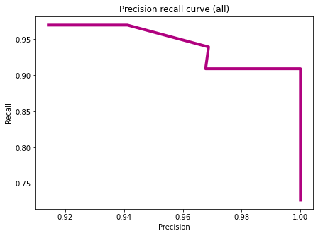

# Breast-Cancer-Diagnosis

For any person suffering from Breast Cancer , the diagnosis whether the cancer is benign or malignant is imperative.We are going to predict whether the tumor is malignant or benign using Machine Learning Models
We have developed  Logistic Regression/ Decision Tree/ Boosted Tree Classifier Models to classify the diagnosis of Breast Cancer cases into malignant and benign.

### Invasive Diagnosis Procedures commonly used for diagnosis of Breast Cancer

Biopsy: For this test, the doctor removes tissue or fluid from your breast. They look at it under a microscope to check for if cancer cells and, if they’re there, learn which   type they are. Common procedures include:
- Fine-needle aspiration:This is for easy-to-reach lumps or those that might be filled with fluid.
- Core-needle biopsy :This type uses a bigger needle to remove a piece of tissue.
- Surgical (open) biopsy: A surgeon removes the entire lump along with nearby breast tissue.
- Lymph node biopsy: The doctor removes a part of the lymph nodes under your arm to see if the cancer has spread.
- Image-guided biopsy: The doctor uses imaging to guide the needle.

**Data collection**
We are using the following Kaggle Dataset <https://www.kaggle.com/uciml/breast-cancer-wisconsin-data>.Contains Fine-needle aspiration results.It Contains 32 columns and 569 rows.

**About the Dataset**
Attribute Information:
1) ID number    
2) Diagnosis (+1 = malignant, -1 = benign) 
3) Ten real-valued features are computed for each cell nucleus:
  - radius 
  - texture 
  - perimeter 
  - area 
  - smoothness 
  - compactness (perimeter^2 / area - 1.0)
  - concavity (severity of concave portions of the contour) 
  - concave points (number of concave portions of the contour)

**List of important features :**
- Standard error of fractal dimension
- Standard error of concave points
- Worst concave points
- Mean of concave points

## Logistic Regression Model --

Accuracy on Training Data : 0.98                                                                                                      
Accuracy on Test Data : 1.00 

## Boosted Decision Tree Model

Accuracy on Training Data : 0.97          
Accuracy on Test Data : 0.95

**Comparing Boosted Tree Models with different number of iterations**

## Decision Tree Model

Accuracy on Training Data : 0.94             
Accuracy on Test Data : 0.96

## Author
Rajarshi Maity
rajarshimaity3235@gmail.com

